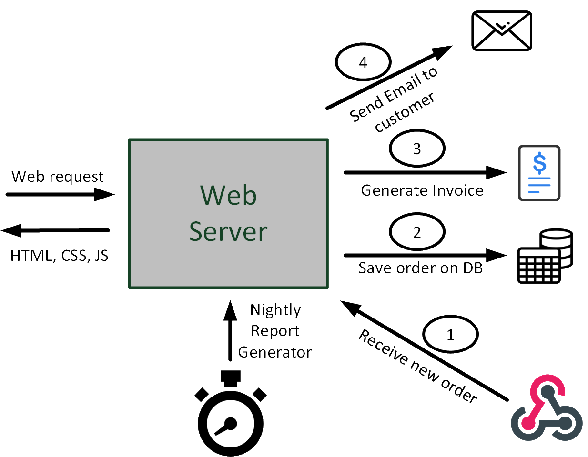

# OrderManagerServerless
This project is a simple implementation of a Order Manager scenario based on Azure Functions and Durable Functions.

## The Scenario
We suppose to provide a REST API to receive orders from our customers.
The steps are the following:
1. The customer makes a POST call to endpoint to place an order (in the body of the request). The schema for the order is:

```json
{
    "orderId":"123456",
    "custName":"Contoso",
    "custAddress":"Main Street, Seattle",
    "custEmail":"info@contoso.com",
    "cartId":"654321",
    "date":"03/10/2020 13:00:00",
    "price":435
}
```
The solution checks if the order is valid and then responds immediately to the customers.

2. The solution saves the order in a database (in the demo we use a storage table).

3. The solution creates the invoice in a blob object. 

4. The solution sends a mail to the customer with the invoice attached

Finally, the solution must implement a batch that, every night, retrieves the orders received during tha day, and creates a daily report.

The process is shown in the following picture:



